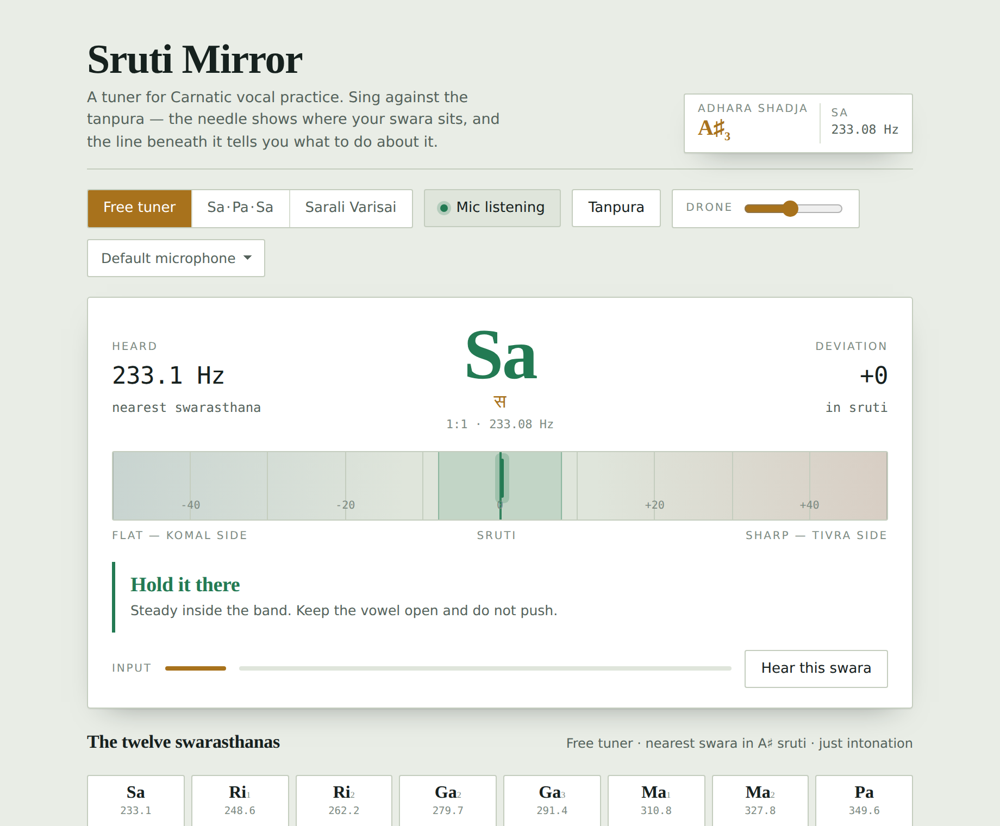
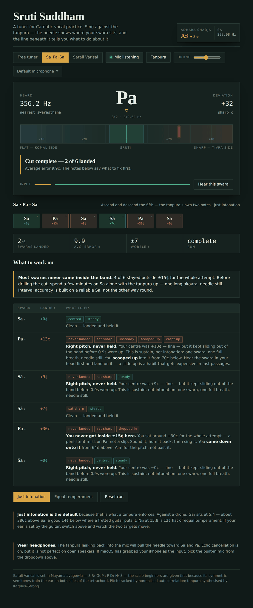

# Sruti Suddham

A pitch tuner for Carnatic vocal practice. It runs in the browser, plays a
synthesised tanpura, and — unlike a guitar tuner — tells you *what to do* about
the note you just sang rather than only how far off it was.



I started this because the tuner apps I could find are built for instruments.
They show you a needle against equal temperament and leave it there. That is the
wrong reference for singing against a drone, and a needle on its own does not
distinguish the four quite different things that go wrong with a held note.

**[Try it →](https://yudistra1.github.io/sruti-suddham/)** (needs a microphone;
headphones strongly recommended)

Works on phones as well as desktop. Open it in a real browser rather than the
one embedded in LinkedIn or Instagram — those frequently refuse microphone
access, and the page will say so if it detects one.

## What it does

Pick your sruti — any of the twelve notes across three octaves — and everything
retunes: the targets, the drills and the tanpura. It defaults to A♯3 and
remembers what you chose. Then three modes:

- **Free tuner.** Names the nearest of the twelve swarasthanas and shows the
  deviation in cents.
- **Sa · Pa · Sa.** Up and down the fifth. Three notes each way.
- **Sarali Varisai.** Mayamalavagowla, arohana and avarohana — sixteen swaras.

In the drills you hold a swara inside ±15 ¢ for 0.9 s and it advances. If you
cannot land one within nine seconds it moves on and logs the miss, so a run
always produces a report.

### It measures four things, not one

A tuner needle conflates them. They have different causes and different fixes:

| | what it is | what it usually means |
|---|---|---|
| **centre** | where the pitch sat on average | ear, or aiming at the wrong target |
| **wobble** | how much it swung around that centre | breath, not ear |
| **onset** | where the note started | scooping up into it |
| **drift** | how far it moved while held | support running out |

So the feedback can say "right pitch, never held — this is sustain, not
intonation" instead of just showing you a jittery needle.



After each cut it also looks for habits across the whole run: overshooting on
the way up and undershooting on the way down, scooping into most notes, or the
one I wrote this for — sitting sharp on exactly the four swaras a
fretboard-trained ear gets wrong.

### Why just intonation is the default

A tanpura enforces ratios, not equal temperament, and the gap is big enough to
hear:

| swara | just | equal | difference |
|---|---|---|---|
| Ri₁ | 16:15 — 112 ¢ | 100 ¢ | +12 ¢ |
| Ga₃ | 5:4 — 386 ¢ | 400 ¢ | −14 ¢ |
| Dha₁ | 8:5 — 814 ¢ | 800 ¢ | +14 ¢ |
| Ni₃ | 15:8 — 1088 ¢ | 1100 ¢ | −12 ¢ |

Fourteen cents is comfortably inside what you can hear as beating against a
drone, and it is most of the ±15 ¢ tolerance. I play guitar, and those four are
precisely where my ear puts things in the wrong place, so the tool calls it out
by name. There is an equal-temperament toggle if you would rather train against
the fretted version.

## Running it

```bash
git clone https://github.com/yudistra1/sruti-suddham.git
cd sruti-suddham
npm start          # http://localhost:8000
```

No dependencies — `npm start` is a ~40-line static server in `tools/`. A server
is needed rather than opening the file directly, because browsers block ES
modules over `file://` and `getUserMedia` refuses to run outside a secure
context. `http://localhost` counts as secure.

```bash
npm test           # 53 tests, no dependencies
npm run build      # -> dist/sruti-suddham.html, one self-contained file
```

The built file is the whole app inlined into one HTML document, for when you
want to drop it somewhere without a build step. It still needs to be served
rather than opened, for the same reason.

## How it works

```
src/
  tuning.js      the tonic, ratios, swarasthanas, cuts, cents arithmetic
  pitch.js       NSDF pitch detection
  microphone.js  capture, device selection, constraint fallbacks
  tanpura.js     Karplus-Strong drone and reference tones
  analysis.js    one attempt -> centre / wobble / onset / drift
  drill.js       the cut state machine
  coach.js       everything the tool says out loud
  ui.js          DOM wiring and the animation loop
```

Everything except `ui.js` is free of DOM and Web Audio, which is what makes the
test suite possible under plain Node.

**Pitch detection** is the normalised square difference function from McLeod &
Wyvill. Plain autocorrelation biases toward the loudest partial and reports
octave errors on sung vowels, which carry a great deal of energy above the
fundamental; normalising by the summed energy of both windows and taking the
*first* peak above 90 % of the global maximum — rather than the maximum itself —
is what keeps it on the fundamental. Parabolic interpolation around that peak
gets the resolution under a cent; without it you are quantised to a whole sample
of lag, which at 400 Hz is about 20 ¢.

**The tanpura** is four Karplus-Strong strings rendered offline into audio
buffers and scheduled on a 1.05 s cycle — Pa, Sa, Sa, then Sa an octave down.
Two layers three cents apart approximate *jvari*, the shimmer the bridge
produces. It is a cheap trick and it is the difference between "drone" and
"tanpura". Nothing loops, so nothing seams.

**The drill** is a plain state machine fed one cents reading per analysis frame.
Because it takes numbers rather than audio, the whole thing — landing, losing
the hold, giving up, skipping — is driven directly from tests.

## Tests

```
npm test
```

`node --test`, no framework. The interesting ones:

- the pitch detector recovers six frequencies across the vocal range to within
  a cent, and does not drop an octave on a synthesised vowel with a deliberately
  weak fundamental;
- broadband noise is rejected rather than read as a confident pitch;
- `summarise` ignores a stretch where a *different* swara was being sung, so a
  missed note's "centre" is not an average of two unrelated pitches;
- the coach names the swara you are actually singing rather than reporting an
  octave error when the pitch class does not match;
- `findPatterns` detects the equal-temperament pull from a run that is sharp on
  Ri₁, Ga₃, Dha₁ and Ni₃ and accurate everywhere else.

`tools/build.js` also refuses to produce a bundle if two modules declare the
same top-level name, rather than emitting a silently broken file.

## Known limitations

- **Speaker bleed.** The drone leaking into the mic pulls the needle toward Sa
  and Pa. Echo cancellation is requested, but it is not reliable on open
  speakers. Wear headphones.
- **macOS Continuity.** macOS will quietly hand the default input to a nearby
  iPhone, which adds latency and heavy processing. There is a device picker in
  the toolbar for this reason; it is usually what you want.
- **In-app browsers.** Links opened inside LinkedIn, Instagram and similar apps
  land in an embedded webview, which often denies `getUserMedia` outright. The
  page detects the common ones and asks you to open it properly instead.
- **iOS silent switch.** With the hardware switch on, iOS mutes Web Audio, so
  the tanpura goes silent with no error. Nothing the page can do about it.
- **Monophonic only.** One voice, no accompaniment.
- **Octave range.** The tonic picker covers octaves 2–4, which spans most voices
  but not all of them.
- **Gamaka.** The tool measures steady swaras. It has nothing useful to say about
  ornamented ones, and a heavily gamaka-laden phrase will read as wobble.

## Licence

MIT — see [LICENSE](LICENSE).
